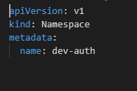

# Kubernetes Deployment Configs

# Deployment of e-Commerce Application :
### Features and deployment environment :
Docker : is a set of platform as a service products that uses OS-level virtualization to deliver software in packages called containers. I used it to dockerize all microservices.
Kubernetes: The app is designed to run on a cluster Kubernetes.
### deploy all microservices :
#### Deployment Struture Configuration :
To well organize all deployments,I create a namespace speficied for every microservice with it's additional deployment Config( dabatabse for example).
 As I am in development process So, I named all namespaces with a `dev-` prefix.
here an example of namespace yaml file :


<br> to get all namespaces, execute the command : ```kubectl get ns```
<br>


####  Deploy microservices :
The deployment of my microservices consists for deploying each service and its needs (either an instance of the database, secrets,configMaps…).
After the dockerizing of our Microservices using Docker,I need to deploy them in kubernetes, each application will be encapsulated in a kubernetes “pod” so that it is a microservice execution unit.
The "repositories-service, and frontend" services do not use a database, so we need to install just the pod of each service. 
- ```In the k8s-manifests every folder contains the necessary yaml files needed to configure a successfully microservice deployment. For every Microservice, I start with deploying secrets and configMaps, and so on , and finally deploy the microservice yaml file to create service Account , kubernetes service, and the deployment```
  
  ##### Example : deploy auth-Service
  *Before execute the following commands make sure to change directory to ```K8s-manifests/auth-service``` or use a relativePath:*
  - Create namespace for the service :
  > kubectl apply -f .\namespace.yaml
  - Create Mysql secrets :
  > kubectl apply -f .\secretsMysql.yaml
  - deploy a mysql service (will create : serviceAccount, service, deployment )
  > kubectl apply -f .\mysql.yaml
  - create user-service secrets :
  > kubectl apply -f .\secretsAuth.yaml
  - create user-service ConfigMap for non sensitive informations :
  > kubectl apply -f .\configMapAuth.yaml
  - deploy the service (will create : serviceAccount, service, deployment )
  > kubectl apply -f .\user-service.yaml

### Deployment Result: 

