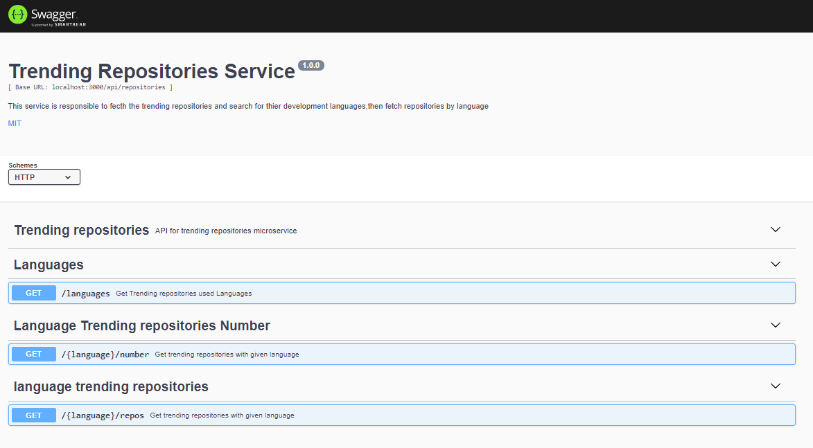

# Analysis and microservices development  

In this section I will cover all development needs and Microservices global structure, and some results of development of all microservices :
  `To read more about every service configs, installtion, runing refer to it's readme.md file`
### Architecture:
My demo application is composed of 3 microservices written in different languages that talk to each other.

  

  Service  | Details
  ------------- | -------------
  **Auth service**: | Developed using **Java/Spring boot** and **MySql** to persist our product.  
  **Repositories Service** | Developed using **Nodejs**,**Babel** for ECMAScript  support and convert to javascript and **@octokit/request** to featch trending repositories.  
  **Frontend Microservice** | Developed using **Typescript/Angular** and **ngxs store** for state management.

## fonctional analyse and sequence :

to realise this projet in a goog way, I firtly begin with a functional analysis. within  this ,I define the main process of user interaction with the application. I can resume the main ineteration results  with the following sequence diagram:

    

### Results :
I could explore results of the developpment of all microservices by consulting the frontend resulting application or by consulting swagger interface of the backend Microservices : 
1. Backend swagger interfaces :
   - Auth-Service :
     
   - Repositories-Service :
   
1.   Frontend Application results :
  We present bellow the app frontend interface :
  - Sign up to application Page :
     
   
  - Sign In to applicaption page interface :
   
  - Trending repositories Languages page :
   
  - Languge Trending repositories page :
   

